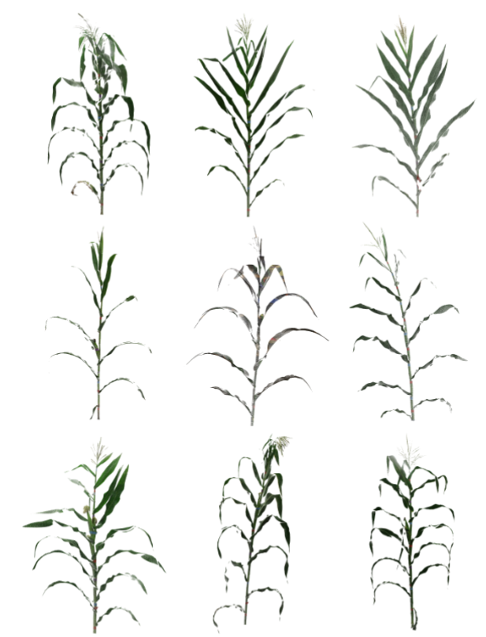
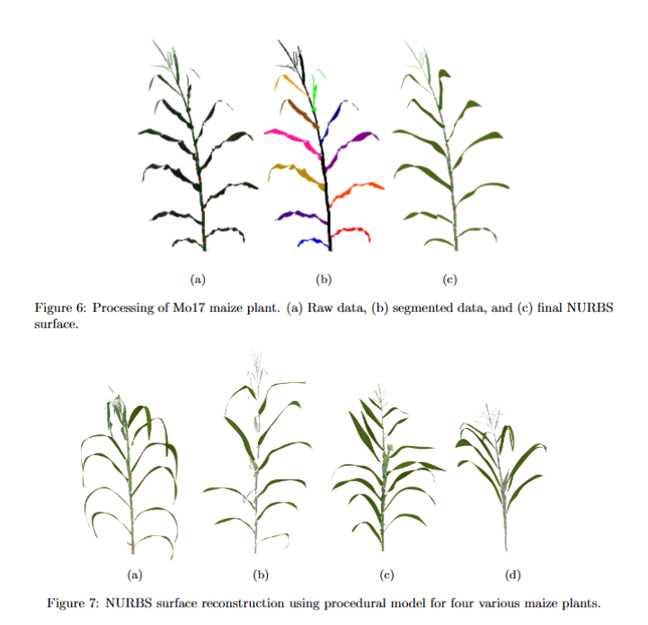
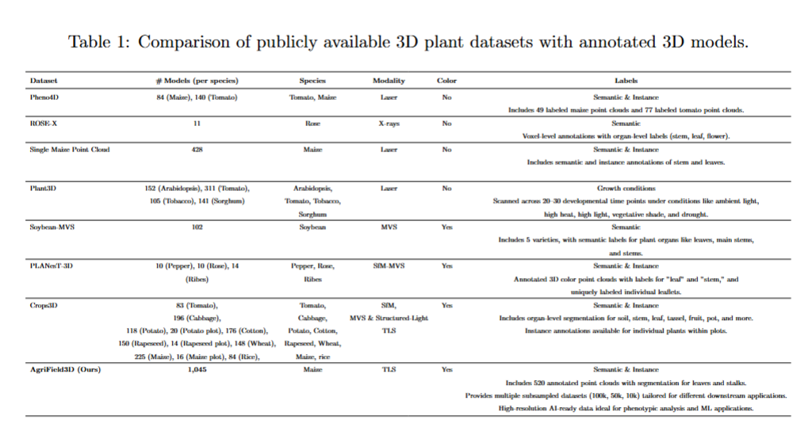

# AgriField3D: A Curated 3D Point Cloud Dataset of Field-Grown Plants from a Maize Diversity Panel

### Authors:
- [Elvis Kimara*](https://www.linkedin.com/in/elvis-kimara/)
- [Mozhgan Hadadi*](https://www.linkedin.com/in/mozhgan-hadadi/)
- [Jackson Godbersen](https://www.linkedin.com/in/)
- [Aditya Balu](https://scholar.google.com/citations?user=GNuXi6oAAAAJ&hl=en)
- [Zaki Jubery](https://scholar.google.com/citations?user=P3h1SM0AAAAJ&hl=en)
- [Adarsh Krishnamurthy](https://scholar.google.com/citations?user=iVTMSxoAAAAJ&hl=en&oi=ao)
- [Patrick Schnable](https://scholar.google.com/citations?user=UW4mNTW0nOkC&hl=en)
- [Baskar Ganapathysubramanian](https://www.me.iastate.edu/bglab/)

**Institution**: Iowa State University  
**Equal Contribution**: Elvis Kimara*, Mozhgan Hadadi*

## Links:
- [Paper (arXiv)](https://arxiv.org/pdf/)
- [GitHub](https://github.com/baskargroup/AgriField3D)
- [Dataset Card](https://huggingface.co/datasets/BGLab/AgriField3D)
- [Model Card](https://huggingface.co/BGLab/AgriField3D)
- [arXiv Abstract](https://arxiv.org/abs/)

 

*Figure 1: Raw Data and Curated Sample in the AgriField3D Dataset.*

## Abstract

The application of artificial intelligence (AI) in three-dimensional (3D) agricultural research, particularly for maize, has been limited by the scarcity of large-scale, diverse datasets. While 2D image datasets are abundant, they cannot capture essential structural details such as leaf architecture, plant volume, and spatial arrangements that 3D data can provide. To address this limitation, we present a curated dataset of 3D point clouds of fully field-grown maize plants with diverse genetic backgrounds designed to be AI-ready for advancing agricultural research. Our dataset comprises over 1,000 high-quality point clouds representing diverse maize varieties collected using a Terrestrial Laser Scanner. To enhance the usability of the dataset, we performed graph-based segmentation to isolate individual leaves and stalk point clouds. Each leaf is assigned a consistent color label across all plants based on its order from bottom to top. Similarly, all stalks are assigned a single, distinct color. A rigorous quality control process was undertaken to manually correct any errors in the segmentation and leaf ordering, ensuring accurate segmentation and consistent color labeling. The dataset includes metadata describing point cloud quality, the number of leaves, and the presence of tassels and maize cobs. This dataset lays the foundation for leveraging 3D data to enable advanced applications in agricultural research, particularly for maize phenotyping and plant structure studies.

---

## Dataset Features

### Nine Sample Images

- Showing the architectural diversity of the maize plants in the dataset.

### Procedural Model Samples

- Top row: Workflow of the procedural model generation.
- Bottom row: Generated sample of the procedural models.

### Comparison with Existing Datasets

- Comparison of AgriField3D dataset with existing datasets.

---

## Acknowledgements

This work was supported by the AI Research Institutes program supported by the **NSF** and **USDA-NIFA** under [AI Institute: for Resilient Agriculture (AIIRA)](https://aiira.iastate.edu/), Award No.2021-67021-35329.

---

## Team

### [Elvis Kimara](https://www.linkedin.com/in/elvis-kimara/)

### [Mozhgan Hadadi](https://www.linkedin.com/in/mozhgan-hadadi/)

### [Jackson Godbersen](https://www.linkedin.com/in/)

### [Aditya Balu](https://scholar.google.com/citations?user=GNuXi6oAAAAJ&hl=en)

### [Zaki Jubery](https://scholar.google.com/citations?user=P3h1SM0AAAAJ&hl=en)

### [Adarsh Krishnamurthy](https://scholar.google.com/citations?user=iVTMSxoAAAAJ&hl=en&oi=ao)

### [Patrick Schnable](https://scholar.google.com/citations?user=UW4mNTW0nOkC&hl=en)

### [Baskar Ganapathysubramanian](https://www.me.iastate.edu/bglab/)

---

## BibTeX Citation

@inproceedings{kimara2025agriField3D,
title={AgriField3D: A Curated 3D Point Cloud Dataset of Field-Grown Plants from a Maize Diversity Panel2},
          author={Elvis Kimara1†, Mozhgan Hadadi3, Jackson Godbersen, Aditya Balu, Zaki Jubery, Adarsh Krishnamurthy, Patrick Schnable, Baskar Ganapathysubramanian},
          booktitle={Arxiv},
          year={2025},
          primaryClass={cs.CV},
          url={}

---
